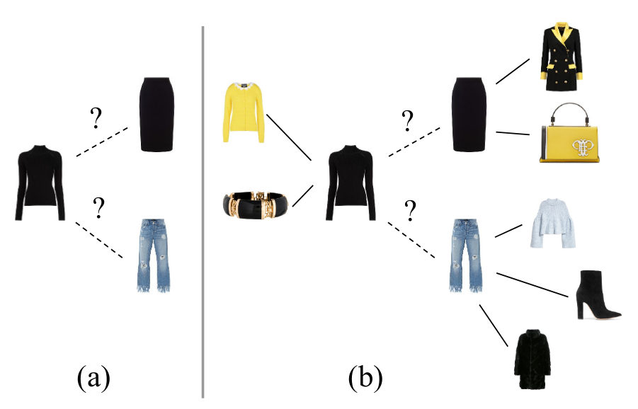

# Context-Aware Visual Compatibility Prediction

<div align="center">
  
</div>

In this repository we provide the implementation for the paper [Context-Aware Visual Compatibility Prediction](https://arxiv.org/abs/1902.03646). We propose a method that predicts compatibility between two items based on their visual features, as well as their context. We define context as the products that are known to be compatible with each of these items. Our model is in contrast to other metric learning approaches that rely on pairwise comparisons between item features alone. We address the compatibility prediction problem using a graph neural network that learns to generate product embeddings conditioned on their context. 

## Requirements

The model is implemented with Tensorflow. All necessary libraries can be installed with:

    pip install -r requirements.txt

## Data
In our experiments, we just use the Polyvore dataset, because We cannot find the other datasets that the paper mentions
### Create empty folders
```shell
mkdir data/polyvore
mkdir src/data/polyvore/dataset
```
### Download [Polyvore dataset](https://github.com/xthan/polyvore-dataset):
Please download full dataset in this [link](https://drive.google.com/drive/folders/1splSxGhduNFZXLb518BusnEwqphyABeK?usp=sharing)

The dataset after downloaded have to pushed in `data/polyvore` 

When all files are downloaded, run:
```shell
bash src/data/polyvore/process_polyvore.sh
```

## Training
The model is trained with the following command:

    python src/models/train_model/train.py

The most relevant arguments are the following:

 - `-lr LR`: Learning rate. `0.001` by  default.
 - `-hi N N N`: One argument per layer that defines the number of hidden units in that layer. Default: `-hi 350 350 350`
 - `-deg D`: Size of the neighbourhood used around each node. Default `1`.
 - `-op OP`: Optimizer to train model. Default `adam`.
 
### For our experiment 1, to train a model like the one described in the paper for the Polyvore dataset, run:
```shell
python src/models/train_model/train.py -hi 350
```
AND 
```shell
python src/models/train_model/train.py -hi 350 350 350 350 350
```
### For our experiment 2, to train a model like the one described in the paper for the Polyvore dataset, run:
```shell
python src/models/train_model/train.py -op "sgd"
```
### For our experiment 3, to train a model like the one described in the paper for the Polyvore dataset, run:
```shell
python src/models/train_model/train.py -deg 3
```
### For our experiment 4, write the result with the full dataset for possible item choices
Please checkout out to branch `dev.full`, and run:
```shell
python src/visualization/vis_out.py --load_from <path_of_model> --result <path_of_result>
```
You can see the result I run [here](https://drive.google.com/drive/folders/1f5OXl8zjFqCO56W_g2BaRPgh8RiAl6Jp?usp=sharing)
### For our experiment 5, write the result with the full dataset for possible item choices (filter category)
Please checkout out to branch `dev.cat`, and run:
```shell
python src/visualization/vis_out.py --load_from <path_of_model> --result <path_of_result>
```
You can see the result I run [here](https://drive.google.com/drive/folders/1-XcDoKXIm91KlkwWhLQJ6kVFFbcQOlyT?usp=sharing)


Which will store the log and the weights of the model in `logs/`.

## Evaluation:
A model trained on Polyvore or FashionGen can be evaluated for the FITB task and the Compatibility prediction task.
Evaluation for the FITB task is performed with:

    python src/evaluate/test_fitb.py -lf PATH_TO_MODEL -k K

and for the compatibility task with:

    python src/evaluate/test_compatibility.py -lf PATH_TO_MODEL -k K

In both cases, K is the maximum number of neighbours used around a node. For Polyvore, the flag `--resampled` can be set to use the resampled version of the task, which is harder.

## Reference
Please cite our paper as:

    @InProceedings{Cucurull_2019_CVPR,
      author = {Cucurull, Guillem and Taslakian, Perouz and Vazquez, David},
      title = {Context-Aware Visual Compatibility Prediction},
      booktitle = {The IEEE Conference on Computer Vision and Pattern Recognition (CVPR)},
      month = {June},
      year = {2019}
    }
    
## License
`MIT`
    
